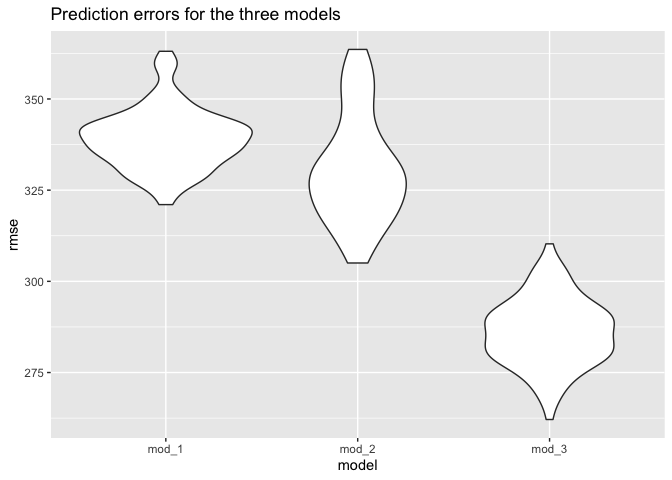

p8105\_hw6\_yw3773
================

``` r
library(tidyverse)
library(modelr)
library(mgcv)
```

## Problem 1

#### data cleaning

``` r
## data cleaning, convert numeric to factor, there is no missing value
birth_df = read_csv("birthweight.csv")

birth_df = birth_df %>%
  mutate(
    babysex = as.factor(babysex),
    babysex = recode(babysex, `1` = "male", `2` = "female"),
    frace = as.factor(frace),
    frace = recode(frace, `1` = "White", `2` = "Black", `3` = "Asian", `4` = "Puerto Rican", 
                   `8` = "Other", `9` = "Unknown"),
    malform = as.factor(malform),
    malform = recode(malform, `0` = "absent", `1` = "present"),
    mrace = as.factor(mrace),
    mrace = recode(mrace, `1` = "White", `2` = "Black", `3` = "Asian", `4` = "Puerto Rican", 
                   `8` = "Other")
  )
```

This data set contains 20 variables and 4342 observations. I converted
“babysex”, “frace” (father’s race), “malform” (presence of
malformations), “mrace” (mother’s race) into factor variables with
appropriate names according to the variables’ information. There is no
missing value.

#### fitting my first model

``` r
## hypothesis plot for model driven
birth_df %>%
  ggplot(aes(y = bwt, x = bhead)) + 
  geom_point(alpha = 0.5, size = 0.5) + 
  labs(title = "Baby's birth weight vs. the head circumference at birth")
```

<!-- -->

``` r
birth_df %>% 
  ggplot(aes(y = bwt, x = babysex)) + geom_boxplot() +
  labs(title = "Baby's birth weight with respect to their birth sex")
```

<!-- -->

I was interested in how baby’s head circumference at birth and the birth
sex are associated with their birth weight. Then I plot two graphs as
above, from the first graph, it seems like there is a positive
relationship between the head circumference and birth weight. From the
second graph, although the two box plots are overlapped, the male’s
median is a little bit higher than the female’s median. So I decide to
fit a linear regression of birth weight on head circumference at birth
and birth sex, and I assume there is no interactions.

``` r
## fit my model for birth weight
fit_1 = lm(bwt ~ babysex + bhead, data = birth_df)
fit_1 %>% 
  broom::tidy() %>%
   knitr::kable(digit = 3)
```

| term          |  estimate | std.error | statistic | p.value |
|:--------------|----------:|----------:|----------:|--------:|
| (Intercept)   | -4924.047 |   109.775 |   -44.856 |       0 |
| babysexfemale |    41.626 |    10.470 |     3.976 |       0 |
| bhead         |   238.276 |     3.230 |    73.779 |       0 |

``` r
birth_df %>%
  modelr::add_predictions(fit_1) %>%
  modelr::add_residuals(fit_1) %>%
  ggplot(aes(y = resid, x = pred)) + 
  geom_point(alpha = 0.3, size = 1) +
  labs(title = "Model residuals against fitted values") +
  xlab("fitted value") + ylab("model residual")
```

<!-- -->

From the model results, we can see that, 1cm increase in baby’s head
circumference is associated with 238.3g increase in baby’s weight. Also,
being a female has a positive effect on baby’s birth weight comparing to
male. From the plot of model residuals against fitted values, we can see
that all points are randomly distributed abound 0, except a few
outliers.

#### fitting the second and third model, and comparing them with model 1

``` r
fit_2 = lm(bwt ~ blength + gaweeks, data = birth_df)
fit_2 %>% broom::tidy() %>%  knitr::kable(digit = 3)
```

| term        |  estimate | std.error | statistic | p.value |
|:------------|----------:|----------:|----------:|--------:|
| (Intercept) | -4347.667 |    97.958 |   -44.383 |       0 |
| blength     |   128.556 |     1.990 |    64.604 |       0 |
| gaweeks     |    27.047 |     1.718 |    15.744 |       0 |

``` r
fit_3 = lm(bwt ~ bhead + blength + babysex + bhead*blength*babysex, data = birth_df)
fit_3 %>% broom::tidy() %>%  knitr::kable(digit = 3)
```

| term                        |  estimate | std.error | statistic | p.value |
|:----------------------------|----------:|----------:|----------:|--------:|
| (Intercept)                 | -7176.817 |  1264.840 |    -5.674 |   0.000 |
| bhead                       |   181.796 |    38.054 |     4.777 |   0.000 |
| blength                     |   102.127 |    26.212 |     3.896 |   0.000 |
| babysexfemale               |  6374.868 |  1677.767 |     3.800 |   0.000 |
| bhead:blength               |    -0.554 |     0.780 |    -0.710 |   0.478 |
| bhead:babysexfemale         |  -198.393 |    51.092 |    -3.883 |   0.000 |
| blength:babysexfemale       |  -123.773 |    35.119 |    -3.524 |   0.000 |
| bhead:blength:babysexfemale |     3.878 |     1.057 |     3.670 |   0.000 |

``` r
birth_df =
  crossv_mc(birth_df, 100) %>% 
  mutate(
    train = map(train, as_tibble),
    test = map(test, as_tibble))

birth_df = birth_df %>%
  mutate(
    mod_1 = map(train, ~fit_1, data = .x),
    mod_2 = map(train, ~fit_2, data = .x),
    mod_3 = map(train, ~fit_3, data = .x)
  ) %>%
  mutate(
    rmse_mod_1 = map2_dbl(mod_1, test, ~rmse(model = .x, data = .y)),
    rmse_mod_2 = map2_dbl(mod_2, test, ~rmse(model = .x, data = .y)),
    rmse_mod_3 = map2_dbl(mod_3, test, ~rmse(model = .x, data = .y))
  )
```

``` r
birth_df %>%
  select(starts_with("rmse")) %>%
  pivot_longer(
    everything(),
    names_to = "model", values_to = "rmse",
    names_prefix = "rmse_"
  ) %>%
  ggplot(aes(x = model, y = rmse)) + geom_violin() +
  labs(title = "Prediction errors for the three models")
```

<!-- -->

``` r
birth_df %>%
  select(starts_with("rmse")) %>%
  pivot_longer(
    everything(),
    names_to = "model", values_to = "rmse",
    names_prefix = "rmse_"
  ) %>%
  group_by(model) %>%
  summarize(avg_rmse = mean(rmse)) %>% 
  knitr::kable(digit = 3)
```

| model  | avg\_rmse |
|:-------|----------:|
| mod\_1 |   339.095 |
| mod\_2 |   330.731 |
| mod\_3 |   286.114 |

After fitting the second and third model and comparing them with the
first model. From both the violin plot and the mean prediction errors,
we can see that the third model (using head circumference, length, sex,
and all interactions) is better fitted comparing two the first and
second models, as it has lower rmse.

## Problem 2

``` r
weather_df = 
  rnoaa::meteo_pull_monitors(
    c("USW00094728"),
    var = c("PRCP", "TMIN", "TMAX"), 
    date_min = "2017-01-01",
    date_max = "2017-12-31") %>%
  mutate(
    name = recode(id, USW00094728 = "CentralPark_NY"),
    tmin = tmin / 10,
    tmax = tmax / 10) %>%
  select(name, id, everything())
```

``` r
## fit the model
set.seed(3773)
weather_results = weather_df %>%
  bootstrap(5000, id = "strap_number") %>%
  mutate(
    models = map(.x = strap, ~lm(tmax ~ tmin, data = .x)),
    results = map(models, broom::tidy),
    results_2 = map(models, broom::glance)
  ) %>%
  select(strap_number, results, results_2) %>%
  unnest(results,results_2)
```

``` r
## Distribution and CI of log(beta_0*beta_1)
result_sum = weather_results %>%
  select(strap_number, term, estimate) %>%
  pivot_wider(
    names_from = term,
    values_from = estimate
  ) %>%
  mutate(intercept = `(Intercept)`) %>%
  select(-`(Intercept)`) %>%
  mutate(log_beta = log(intercept * tmin))

result_sum %>%
  ggplot(aes(x = log_beta)) + geom_density() +
  labs(title = "Distribution of log(B_0*B_1)",
       x = "log(B_0*B_1)")
```

<!-- -->

``` r
log_beta_CI = result_sum %>%
  summarize(
    ci_lower_log_beta = quantile(log_beta, 0.025), 
    ci_upper_log_beta = quantile(log_beta, 0.975))

log_beta_CI %>%  knitr::kable(digit = 3)
```

| ci\_lower\_log\_beta | ci\_upper\_log\_beta |
|---------------------:|---------------------:|
|                1.965 |                2.059 |

``` r
## distribution and CI for adj.r.square
weather_results %>%
  filter(term == "tmin") %>%
  ggplot(aes(x = r.squared)) + geom_density() +
  labs(title = "The distribution of r.squared")
```

<!-- -->

``` r
r_square_CI = weather_results %>%
  filter(term == "tmin") %>%
  summarize(
    ci_lower_r = quantile(adj.r.squared, 0.025),
    ci_upper_r = quantile(adj.r.squared, 0.975)
  )

r_square_CI %>%  knitr::kable(digit = 3)
```

| ci\_lower\_r | ci\_upper\_r |
|-------------:|-------------:|
|        0.894 |        0.927 |

Above are the distribution plots of
*l**o**g*(*β*<sub>0</sub> \* *β*<sub>1</sub>) and *r̂*<sup>2</sup>. From
the first plot of *l**o**g*(*β*<sub>0</sub> \* *β*<sub>1</sub>), we can
see that it’s approximately normally distributed around 2.02, the 95%
confidence interval is (1.96, 2.06). From the second plot of
*r̂*<sup>2</sup>, we can see that it’s approximately normally distributed
around 0.91, the 95% confidence interval is (0.89, 0.93).
